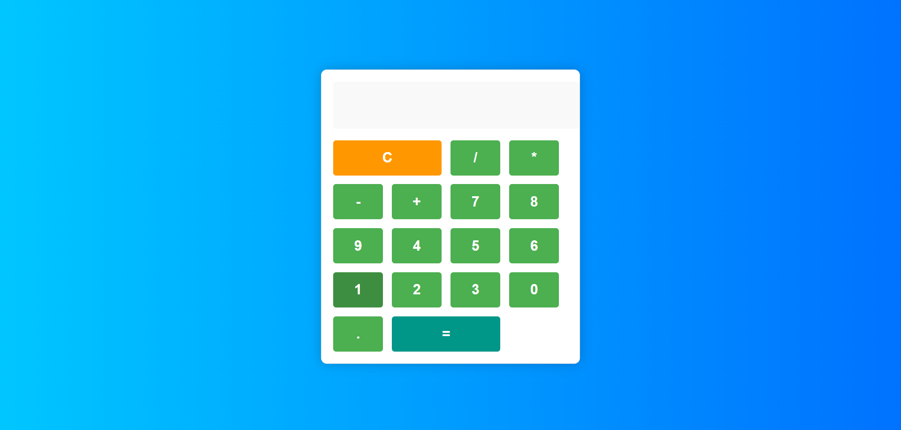

 ## Description

This project implements a basic calculator using HTML, CSS, and JavaScript. It allows users to perform addition, subtraction, multiplication, and division operations on numbers entered via a simple interface. The calculator features clear and equals buttons, supports decimal inputs, and displays results dynamically on the screen. It uses event listeners to handle button clicks, manages current and previous numbers, and computes results based on selected operators, enhancing user interactivity for basic mathematical calculations.

# Screenshots

## Features
- Supports addition, subtraction, multiplication, and division operations.
- Clear (AC) and Equals (=) buttons.
- Decimal point input.
- Dynamic display of numbers and results.
- Operator selection via buttons (+, -, *, /).
- Basic error handling (e.g., division by zero).
- Responsive design for various devices.
- User-friendly interface for intuitive operation.

## Author

Akanksha Saraf

